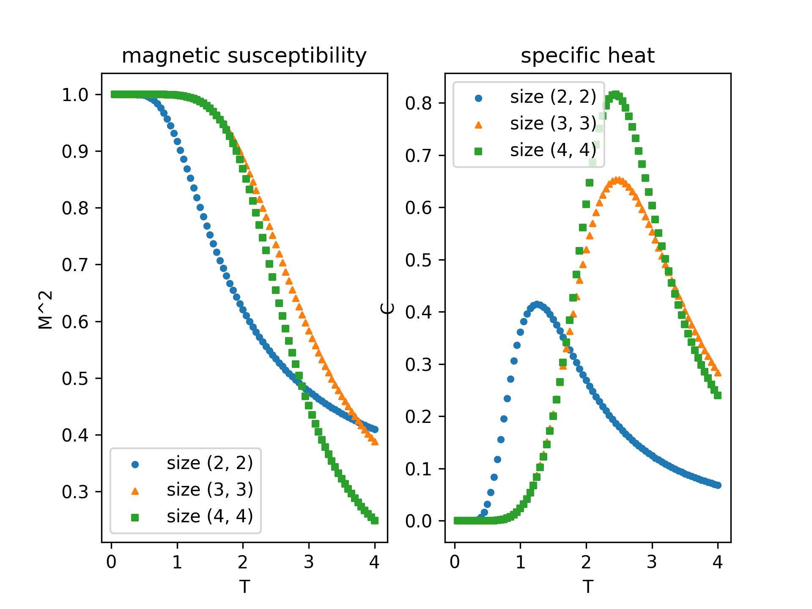

# ComputationalPhysics

This repository stores code for the course PHY2509, computational physics.

Student name: Liang Shu Yi

Student ID: 522070910103

Student email: neville_liang@sjtu.edu.cn

***

## Square lattice report

The code is based on TDD, so methods (including initializing, flipping, calculating hamiltonion, magnetization, partition and average of quantities) have all went through unit tests after being implemented.

At first try, a method `get_weight` calculates weight for each spin configuration, and a comprehensive method `get_average` iterates over every possible spin configuration, and calculate physical qunatities including $E$, $<M>$, $<M^2>$. However, it turns out that instantiating every possible state takes too long, so I directly calculate the average of magnetization and hamiltonion based on their spin configuration.

